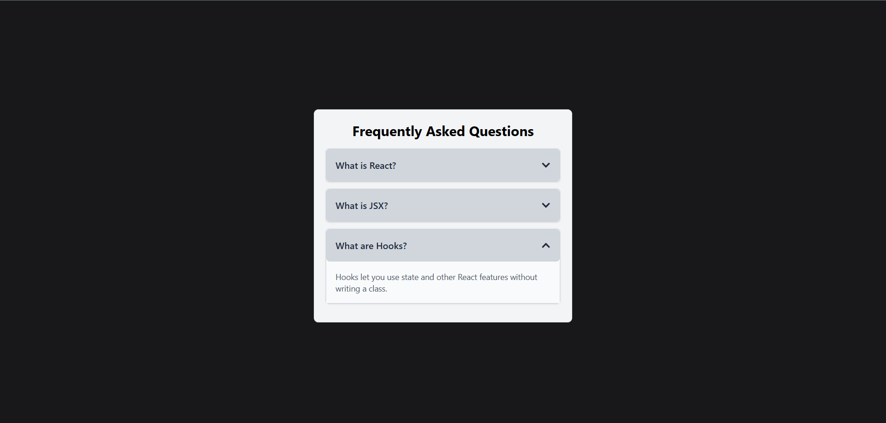

# React Accordion Component

A simple and responsive Accordion component built with React.js and Tailwind CSS.
It displays a list of questions that can be expanded or collapsed to show the answers — perfect for FAQs or collapsible sections.

## Features

- Built using React functional components
- Uses React Hooks (useState) for toggling
- Includes up/down arrow icons with react-icons

## Project Screen-shoot

