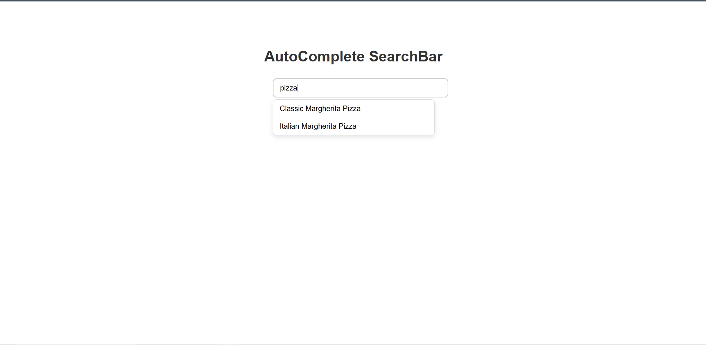

# 🍳 AutoComplete Recipe Search App

A simple and interactive **React.js** project that implements an **autocomplete search bar** to fetch and display recipe data from a public API.  
The app features **debounced API calls**, **local caching**, and **click-based detail display** for selected recipes.

---

 ## 🖼 Screenshot of project

---

## 🚀 Features

- **Live Search with Debounce**
  - Fetches matching recipes as you type.
  - Waits 300ms before fetching to reduce API calls.

- **Caching for Faster Results**
  - Stores previously searched results locally using state-based caching.

- **Click-to-View Recipe Details**
  - Displays recipe name, cuisine, and other details when a result is selected.

- **Smart UI**
  - Results box shows only when typing or focused.
  - Results close automatically when clicked or blurred.

---

| **Fetch API** | To retrieve data from [DummyJSON Recipes API](https://dummyjson.com/docs/recipes) |

---

## **Main Functional Flow**

1. User types in the input box → `input` state updates  
2. `useEffect` triggers a **debounced API call** (after 300ms)  
3. Results appear in the dropdown  
4. User clicks a recipe → `selectedRecipe` updates and shows details  
5. If a new search starts → previously selected recipe clears  

---

## **Important Functions**

### `fetchData()`
- Fetches recipes from the DummyJSON API.
- Checks cache first to avoid unnecessary network calls.
- Stores new results in both `results` and `cache`.

### `handleSelectRecipe(recipe)`
- Called when a user clicks a recipe from the dropdown.
- Updates `selectedRecipe` and hides dropdown results.

---

